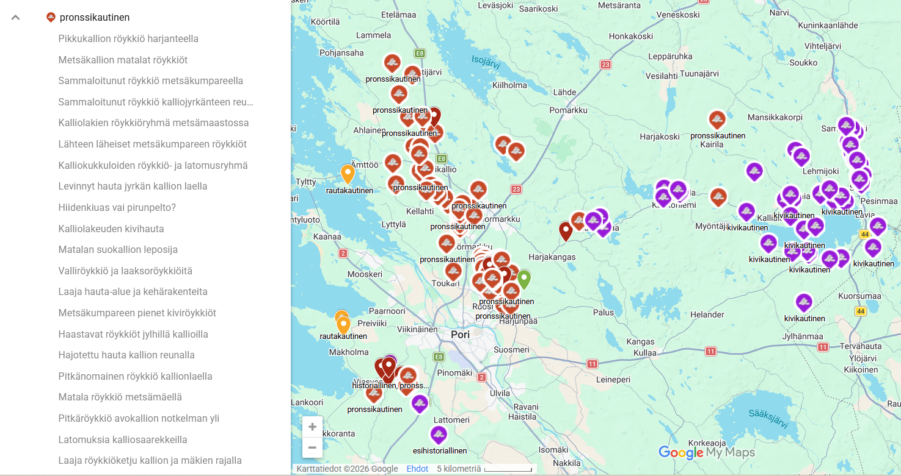
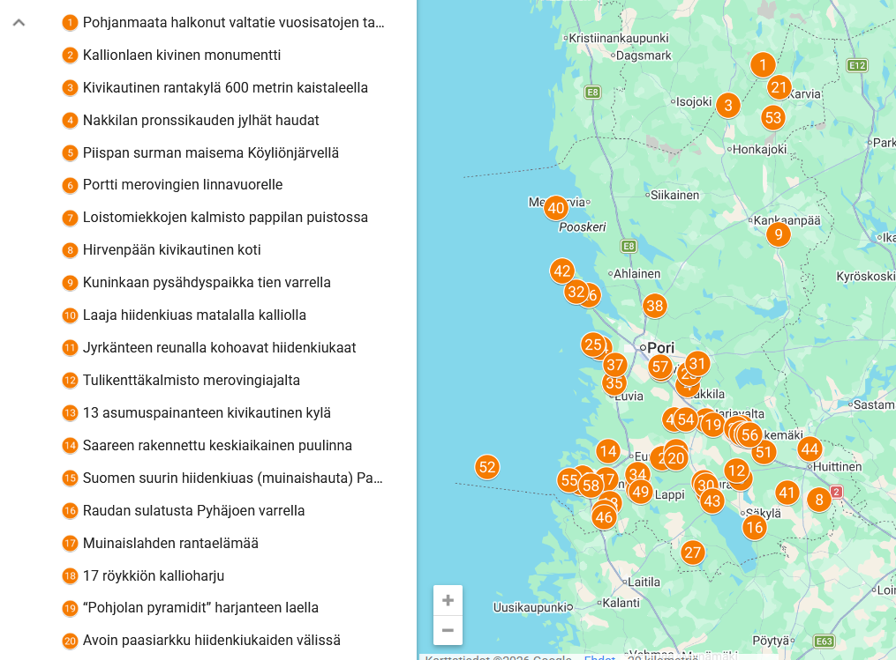

# Maps

# Teemakarttoja

Kokoelma avoimeen dataan perustuvia teemakarttoja. 
Tarkoituksena on ollut testata erilaisia datankäsittelytapoja. 

# Tekijä ja lisenssi

Aineistojen koosteet ja muokkaukset: Nina Mäki-Kihniä, CC BY 4.0.
Alkuperäiset lähteet mainittu kunkin kartan dokumentaatiossa. AI:n mahdollinen käyttötapa työvaiheissa on kuvattu kunkin kartan dokumentaatiossa.

---

## Kartat

### 1. Hiisi vie! Hiisi paikannimissä.

Yli 3000 suomalaista hiisi-aiheista paikannimeä teemoiteltuna maastotyypin mukaan. Nimet kattavat koko Suomen sekä historiallisen Karjalan alueen. Sijaintitiedot vaihtelevat virallisesta paikkatiedosta pitäjätason arvioon — koordinaattityö on work in progress. 

**[→ Avaa kartta Google MyMaps](https://www.google.com/maps/d/viewer?mid=1uS2h4ZhkRTX3bvDv-s5OkpvR-TzxSig&ll=61.23503417659103%2C25.710042486408753&z=7)**  
[Dokumentaatio](docs/hiisi-readme.md)

---

### 2. Muinaisia mestoja kuvauksineen. Osa 1.

Muinaisröykkiöitä kivi- ja pronssikaudelta ja niiden sanallinen kuvaus. Satakunta. 

**[→ Avaa kartta](https://www.google.com/maps/d/viewer?mid=18OPoHMsIZYx1xNXnfnKsk5AgQzB-GO4)**  
[Dokumentaatio](docs/muinaisiamestoja-1-workflow.md)

---

### 3. Mitä mielenkiintoista Satakunnan VARK-kohteissa?

Valtakunnallisesti merkittävät arkeologiset kohteet (VARK) Satakunnan alueella kartalla. 
Kiinnostavat nostot ja kuvaukset kohteista!

**[→ Avaa kartta](https://www.google.com/maps/d/viewer?mid=1J2juMMWjWVPPK0vLmw-kmGonwWZR-oI)**  
[Dokumentaatio](satakunnan-vark-kohteet/README.md)

---

## Tekijä ja lisenssi

Aineistojen koosteet ja muokkaukset: Nina Mäki-Kihniä, CC BY 4.0.  
Alkuperäiset lähteet mainittu kunkin kartan dokumentaatiossa.
AI:n mahdollinen käyttötapa työvaiheissa on kuvattu kunkin kartan dokumentaatiossa.

